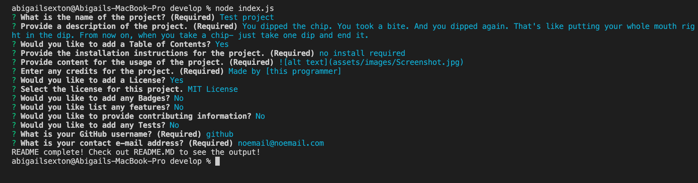

# Professional README Generator Starter Code

# README Generator
    

This is a Node.js application that will generate a README.md file for GitHub projects based on user input.

# Table of Contents
    
* [Installation](#installation)
* [Usage](#usage)
* [Credits](#credits)
* [Questions](#questions)
* [License](#license)

# Installation

Clone the repositry from GitHub and open using Visual Studio Code.

# Usage 
[]

# Credits

Made by [Abby Sexton]

[NPM inquirer.js](https://www.npmjs.com/package/inquirer)

# Questions

[Contact Me](abigail.c.sexton1@gmail.com)

[GitHub](https://github.com/abbycav7)

# License
    
MIT License
    